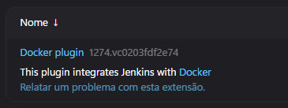
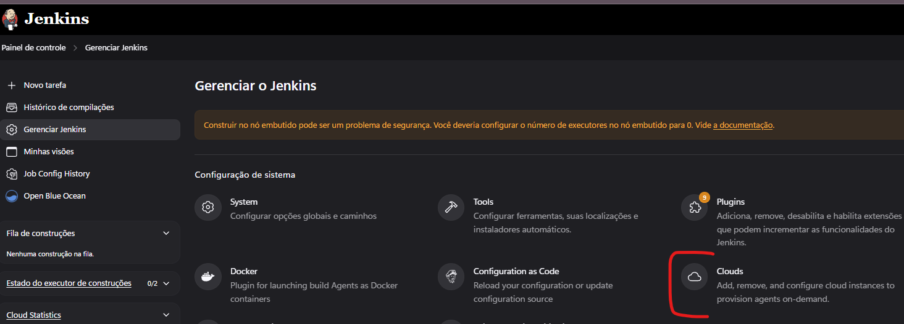
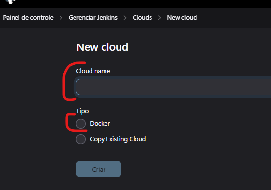
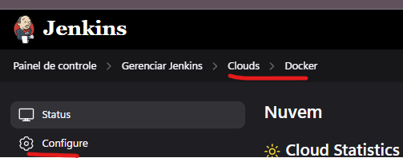
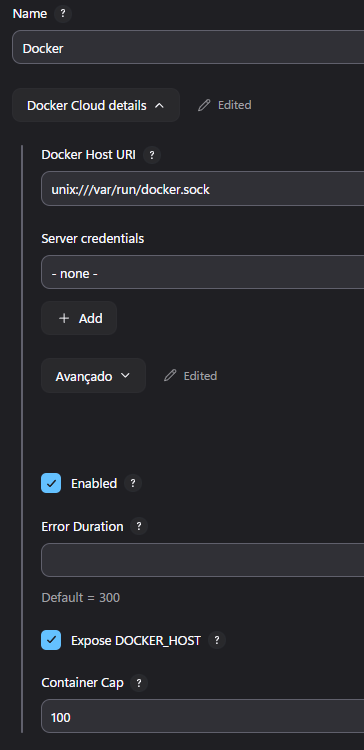
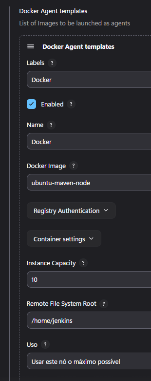
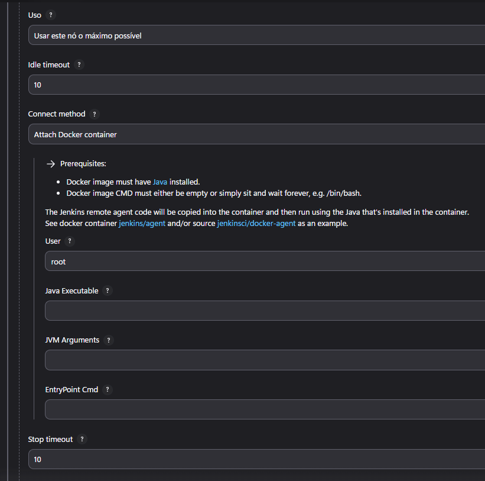
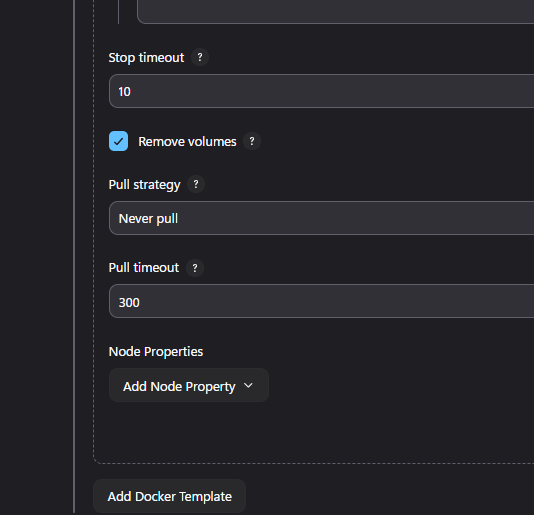
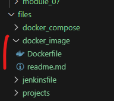

# 🐳 Jenkins em Docker - Módulo 2

<div align="center">
  
  
</div>

## 1. 🏗️ Jenkins e Docker

### ✅ Benefícios Principais

```
• Escalabilidade simplificada
• Recuperação rápida em falhas (recriação de containers)
```

### 🏷️ Imagens Oficiais

```
jenkins/jenkins:latest-jdk21      # Versão LTS com JDK 21
jenkins/jenkins:latest-jdk17      # Versão LTS com JDK 17
jenkins/jenkins:latest            # Última versão 
```

## 2. 🚀 Executando Jenkins em Docker

### 🏃 Comando Básico de Inicialização

```
docker run -d \
  --name jenkins \
  -p 8080:8080 \
  -p 50000:50000 \
  -v jenkins_data:/var/jenkins_home \
  -v /var/run/docker.sock:/var/run/docker.sock \
  -e JAVA_OPTS="-Xmx2048m -Xms512m" \
  --restart unless-stopped \
  jenkins/jenkins:lts-jdk17
```

### 💾 Estratégias de Persistência

```
# Volume nomeado (produção)
docker volume create jenkins_data
docker run -v jenkins_data:/var/jenkins_home ...

# Bind mount (desenvolvimento)
docker run -v $(pwd)/jenkins_home:/var/jenkins_home ...

# Backup de volume
docker run --rm -v jenkins_data:/source -v $(pwd):/backup \
  alpine tar czf /backup/jenkins_backup_$(date +%Y%m%d).tar.gz -C /source .
```

### 🌐 Configuração de Rede

```
# Criar rede dedicada
docker network create --driver bridge jenkins_network

# Executar com configurações otimizadas
docker run \
  --network jenkins_network \
  --dns 8.8.8.8 \
  --dns-search example.com \
  ...
```

## 3. 🎛️ Docker Compose Avançado

```
version: '3.8'

services:
  jenkins:
    image: jenkins/jenkins:lts-jdk17
    container_name: jenkins
    hostname: jenkins-ci
    user: root
    ports:
      - "8080:8080"
      - "50000:50000"
    environment:
      - TZ=America/Sao_Paulo
      - JAVA_OPTS=-Xmx2g -Djenkins.install.runSetupWizard=false
      - CASC_JENKINS_CONFIG=/var/jenkins_home/casc.yaml
    volumes:
      - jenkins_data:/var/jenkins_home
      - /var/run/docker.sock:/var/run/docker.sock
      - ./casc:/var/jenkins_home/casc
    networks:
      - jenkins-net
    deploy:
      resources:
        limits:
          cpus: '2'
          memory: 4G
        reservations:
          memory: 2G

  agent:
    image: jenkins/agent:jdk11
    depends_on:
      - jenkins
    environment:
      - JENKINS_URL=http://jenkins:8080
      - JENKINS_SECRET=agent-secret
      - JENKINS_AGENT_NAME=docker-agent
    volumes:
      - /var/run/docker.sock:/var/run/docker.sock
    networks:
      - jenkins-net

volumes:
  jenkins_data:

networks:
  jenkins-net:
    driver: bridge
    ipam:
      config:
        - subnet: 172.20.0.0/24
```

## 5. 🚨 Troubleshooting

```
# Acessar logs do container
docker logs -f jenkins

# Executar comandos dentro do container
docker exec -it jenkins bash

# Verificar consumo de recursos
docker stats jenkins

# Resetar admin password
docker exec jenkins cat /var/jenkins_home/secrets/initialAdminPassword
```

## 6. 📚 Configurando o Docker para ser provedor de agents

Primeiramente instale o plugin do Docker

Painel de Controle → Na sessao de Configuração de sistema → Plugins

Clique em Extensões e procure por docker-plugin



Após a instalação reinicie o container do Jenkins ou parando e iniciando novamente o compose

Ao iniciar o container do Jenkins, vá para a pagina de configuração de Cloud

Painel de Controle → Na sessao de Configuração de sistema → Clouds



Clique no botão New Cloud, selecione Docker e preencha o nome da Cloud como Docker



Ao ser criado abra a Cloud criada e depois clique em Configure



Agora clique em `Docker Cloud Details`, deixe a configuração conforme print abaixo

Pelo mapeamento do docker-compose.yml o Docker Host URI deve ser `unix:///var/run/docker.sock` dessa forma será o suficiente para o container do Jenkins comunicar corretamente com o Docker Desktop da maquina host



Agora clique em `Docker Agent Template`, configure dessa forma

O nome `ubuntu-maven-node` referencia-se a uma imagem local que foi preparada para esse laboratorio, mas pode ser qualquer imagem que esteja disponivel em algum registry ou localmente a configuração `Pull strategy` deve ser `Never pull` para forçar que o container seja criado a partir da imagem local







Para criar a imagem local basta entrar no diretorio [./files/docker_image/](../../files/docker_image/)

 

E executar o seguinte comando

```bash
docker build -t ubuntu-maven-node .
```

Esse assunto será continuado no <a href="../module_05/readme.md">Jenkins Pipeline Avançado - Módulo 5
</a>